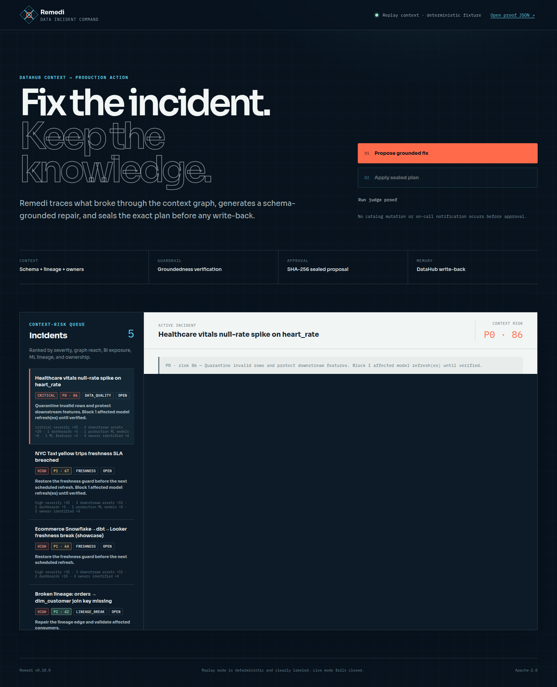
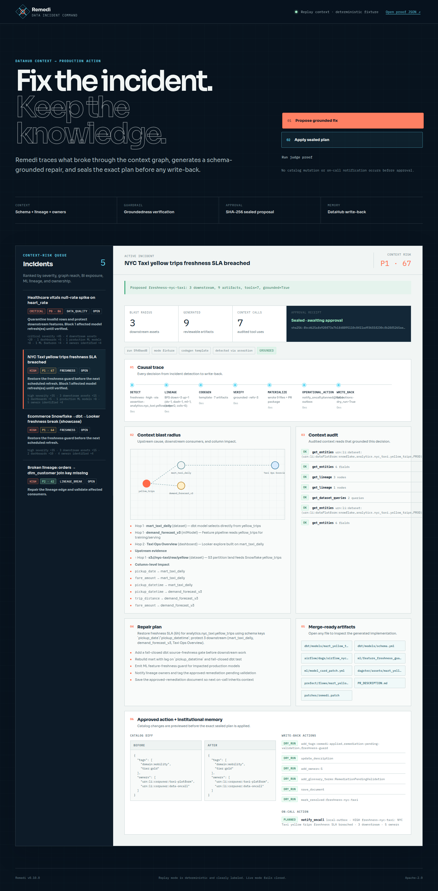
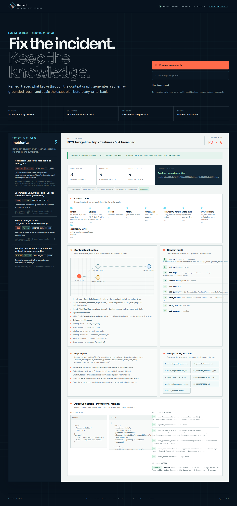
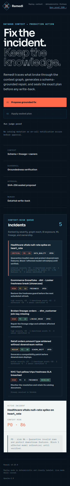
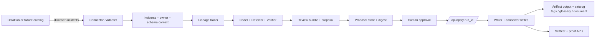

# Remedi

**Data on-call that actually fixes things** — powered by [DataHub](https://datahubproject.io) context.

Remedi is an AI agent that detects data incidents from DataHub, traces blast radius via lineage, generates merge-ready remediation code (dbt / SQL / Airflow), and writes the resolution back into the catalog so the next human or agent inherits the knowledge.

Built for the [DataHub Agent Hackathon](https://datahubproject.io).

## Why it matters

Catalog search alone doesn't ship fixes. Remedi closes the loop:

```
incident → lineage blast radius → codegen PR artifacts → DataHub write-back
```

## Quickstart (fixture mode — no DataHub required)

```bash
make verify-local        # pytest + selftest (recommended gate)
uv run remedi serve      # → http://localhost:8790
```

Or step-by-step: `uv sync` → `uv run remedi selftest` → `uv run remedi serve`.

## For judges

**< 5 min path:** [`hack/DEMO.md`](hack/DEMO.md) · Criteria: [`hack/JUDGES.md`](hack/JUDGES.md) · Deploy: [`hack/DEPLOY.md`](hack/DEPLOY.md)

## What judges should look at

| Path | Purpose |
|---|---|
| `examples/generated/` | Sample merge-ready artifacts (5 incidents) |
| `examples/transcripts/` | Example DataHub tool-call transcript |
| `examples/fixtures/` | Labeled replay catalog: assertions + lineage |
| `skills/remedi/SKILL.md` | DataHub Skill draft for OSS bonus |
| `hack/JUDGES.md` | Judge walkthrough |
| `hack/strategy.md` | Why this wins |

## Demo highlights (v0.10.0)

- **Data incident command UI** — context-risk queue, causal trace, graph evidence, and approval receipt
- **Approved operational action** — Propose previews; Apply sends or records an on-call handoff
- **Strict live boundary** — entity, lineage, search, and mutation failures never fall back
  to replay data or local success
- **Context-risk triage** — automatically ranks the queue from severity + DataHub graph impact
- **Deep selftest suite** — includes action gating, triage, generated-code validation,
  replay defense, and tamper rejection
- **Propose stores `run_id` → Apply exact plan** (no silent re-codegen)
- **Tamper-evident approval digest** — Apply rejects a stored plan changed after review
- **Groundedness badge** — proves columns ⊆ DataHub schema
- Upstream + **column impact** in blast radius
- DQ → `feature_quality_gate.py`; freshness → Airflow **+ Dagster + Prefect**
- `mlFeature` (Feast) → model lineage; glossary term write-back
- **`remedi selftest`** / UI Selftest button for submission confidence
- Assertion detection, tool audit, SVG graph, PR packages






## One-command judge path

```bash
make demo    # tests + selftest + generate artifacts
make serve   # http://localhost:8790
```

UI flow: **Propose grounded fix** → review graph/tools/groundedness/PR → **Apply sealed plan**.  
Optional: click **Run judge proof** or open `/api/selftest`.

Optional browser proof (uses installed Chrome and an ephemeral Playwright environment):

```bash
# Keep `uv run remedi serve` running in another terminal.
uv run --with playwright python scripts/browser_smoke.py
```

## Live DataHub mode

1. Start DataHub via [Quickstart](https://docs.datahub.com/docs/quickstart)
2. `./scripts/load-datapack.sh showcase-ecommerce`
3. `export REMEDI_MODE=live REMEDI_API_KEY=... DATAHUB_GMS_URL=http://localhost:8080 DATAHUB_TOKEN=...`
4. `uv run remedi serve`

Optional LLM codegen: set `OPENAI_API_KEY`. Without it, Remedi uses its explicit,
schema-grounded deterministic generator. When a key is configured, provider failures
are surfaced and never silently replaced with template output.

Optional action delivery: set `REMEDI_OPS_WEBHOOK_URL` and
`REMEDI_OPS_WEBHOOK_KIND=slack|generic`. Propose never sends. Without a webhook, Apply writes a
durable receipt to `examples/notifications/outbox.json`. Any configured external webhook also
requires `REMEDI_API_KEY`, including in fixture mode, so a public replay cannot trigger real
notifications anonymously.

Live mode discovers failing DataHub assertions, then reads entities, lineage, query history,
and search through the DataHub SDK and Agent Context Kit. Approved Apply operations write
pending-validation tags, descriptions, owners, glossary terms, and an approved-remediation
document to DataHub. Provider
failures are returned as errors and never substituted with replay state. A failing assertion
remains active until the underlying pipeline emits a real passing assertion run; Remedi does
not fabricate that result. Use fixture mode only for the clearly labeled deterministic replay.
The verified sample datapack provides catalog metadata but does not manufacture a failing
assertion, so the live incident list remains empty until a real assertion run fails.
All live `/api/*` routes except `/api/health` require `REMEDI_API_KEY` via
`Authorization: Bearer <key>` or `X-API-Key`; startup fails if that key is missing.
The browser asks for this value once per tab and keeps it in `sessionStorage`.

```bash
curl -H "Authorization: Bearer ${REMEDI_API_KEY}" http://localhost:8790/api/incidents
```

## Architecture (short)



For the full narrative and dependency split (`fixture` vs `live`), see [`hack/architecture.md`](hack/architecture.md).

## License

Apache License 2.0 — see [LICENSE](./LICENSE).
