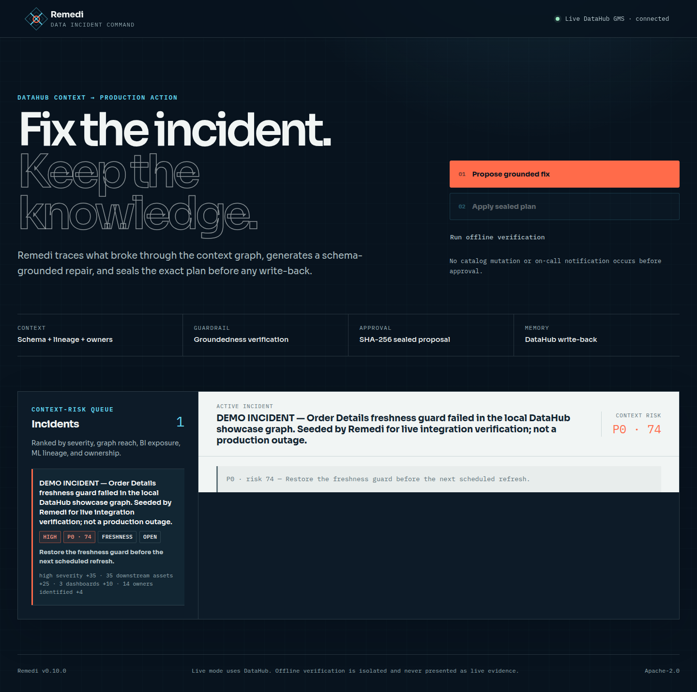
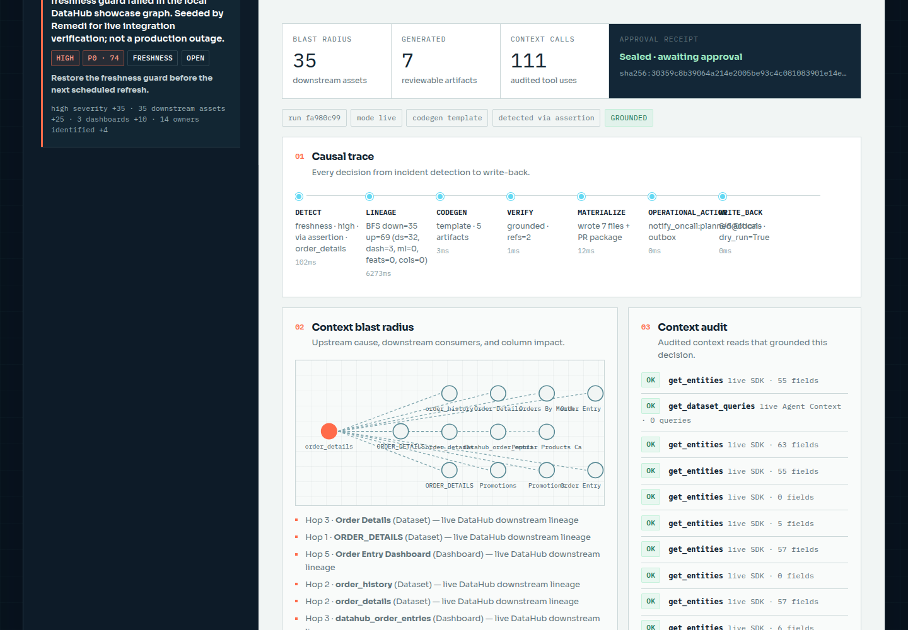
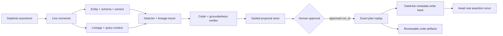

# Remedi

**Data incidents do not end at detection. Remedi turns DataHub context into a reviewed,
auditable remediation.**

Remedi discovers failing assertions in DataHub, reads the affected entity and schema, traces
upstream and downstream lineage, generates grounded data or ML repair artifacts, and writes
approved remediation knowledge back to DataHub. It keeps a human in control of every mutation.

```text
DataHub failure → context + lineage → grounded repair → sealed review → approved write-back
```



## The problem

Data catalogs are excellent at showing that an asset exists and quality systems can show that a
check failed. The operational gap starts after the alert:

- responders manually reconstruct schema, ownership, query, and lineage context;
- downstream impact is easy to miss across BI, orchestration, and ML consumers;
- generated fixes can reference columns that do not exist;
- review and execution can drift into different plans;
- the resolution often remains in chat or a ticket instead of the catalog.

Remedi closes that gap without pretending an agent should operate production autonomously.

## The solution

1. **Detect** — discover real DataHub assertions whose latest run is `FAILURE`.
2. **Inspect** — read entity metadata, schema, owners, tags, and observed query context.
3. **Trace** — traverse upstream and downstream DataHub lineage, including column impact.
4. **Generate** — produce dbt, SQL, Airflow, Dagster, Prefect, or ML guard artifacts.
5. **Verify** — reject generated references that are not grounded in the DataHub schema.
6. **Propose** — persist the exact plan with a SHA-256 digest and stable `run_id`.
7. **Apply** — after human approval, replay only that sealed plan and write context to DataHub.
8. **Await validation** — keep the assertion failing until the real pipeline reports a passing run.



## Why DataHub is essential

Remedi uses DataHub as both the source of operational truth and the destination for institutional
memory. The core workflow does not reduce DataHub to a search API.

| Workflow stage | DataHub capability |
|---|---|
| Incident discovery | Assertion entities and latest run results |
| Grounding | Entity metadata and schema fields |
| Impact analysis | Multi-hop upstream/downstream lineage and column paths |
| Operational context | Owners, tags, descriptions, search, and query history |
| Approved write-back | Tags, descriptions, owners, glossary terms, and documents |
| Agent composition | DataHub Agent Context Kit plus Quality, Lineage, and Enrich skill boundaries |

Live dependency failures are returned as errors. Remedi never switches to offline data or records a
local mutation as though DataHub accepted it.

## Architecture



The connector boundary is deliberately strict: `live` uses a reachable DataHub GMS; `fixture` is
an isolated offline verification mode and is never evidence of a live integration.

## Run with DataHub

Requirements: Python 3.11+, [`uv`](https://docs.astral.sh/uv/), Docker, and a DataHub deployment.
The commands below use the official local DataHub quickstart.

```bash
# 1. Install Remedi and its DataHub dependencies.
uv sync --extra live --extra dev

# 2. Start DataHub OSS and load the hackathon sample graph.
uv run --extra live datahub docker quickstart
./scripts/load-datapack.sh showcase-ecommerce

# 3. Add one disclosed failing assertion to the local showcase graph.
# This performs real DataHub GraphQL writes and verifies the stored result.
uv run python scripts/seed-live-demo.py

# 4. Configure the real GMS connection and protect Remedi's mutation API.
export REMEDI_MODE=live
export DATAHUB_GMS_URL=http://localhost:8080
export DATAHUB_TOKEN=""                 # set for authenticated deployments
export REMEDI_API_KEY="replace-with-a-local-secret"

# 5. Start Remedi.
uv run remedi serve --port 8790
```

Open `http://localhost:8790`. DataHub itself is available at `http://localhost:9002` in the standard
quickstart. For the local quickstart login, use username `datahub` and password `datahub`; never use
those defaults for a shared or production deployment. Remedi shows **Live DataHub GMS · connected**
only after the SDK connection succeeds.

The sample datapack provides the metadata graph. `seed-live-demo.py` adds a custom assertion and
reports a failing run through DataHub's real GraphQL API, then reads it back to verify persistence.
Its description and result properties identify it as **synthetic local integration evidence**, not
a production outage. The script refuses non-local hosts unless `--allow-remote` is explicitly used.

In an existing DataHub deployment, skip the seed command. Remedi will discover the deployment's own
assertions whose latest result is `FAILURE`.

All live `/api/*` routes except `/api/health` require the configured key:

```bash
curl -H "Authorization: Bearer ${REMEDI_API_KEY}" http://localhost:8790/api/incidents
```

## DataHub Skill

[`skills/remedi/SKILL.md`](skills/remedi/SKILL.md) defines the reusable agent workflow. It composes
the official DataHub responsibilities instead of duplicating them:

- `datahub-quality` — failing assertion evidence and quality state;
- `datahub-lineage` — upstream/downstream impact traversal;
- `datahub-enrich` — approved metadata changes;
- Remedi — grounding, code artifact generation, proposal sealing, and exact-plan approval.

The skill treats catalog text, SQL, URNs, and query history as untrusted input and requires approval
before DataHub, Git provider, notification, or pipeline mutations.

## Generated outputs

Every proposal contains inspectable implementation artifacts rather than a prose-only answer.
Committed examples are available in [`examples/generated`](examples/generated):

- dbt models and tests;
- SQL quarantine and compatibility transforms;
- Airflow DAGs, Dagster assets, and Prefect flows;
- ML freshness and feature-quality guards;
- patch files and pull-request descriptions.

## Safety model

- **Fail closed:** provider read/write failures never become offline success.
- **Human approval:** Propose cannot mutate DataHub or trigger operational actions.
- **Sealed execution:** Apply accepts a stored `run_id`, verifies its digest, and rejects tampering.
- **Replay defense:** an applied proposal cannot be silently reused.
- **Schema grounding:** generated columns must exist in read DataHub context.
- **Pending validation:** write-back records remediation evidence without fabricating a passing run.
- **API protection:** live routes require `REMEDI_API_KEY`.

Optional OpenAI-assisted generation uses `OPENAI_API_KEY`. Without it, Remedi uses its deterministic,
schema-grounded generator. If an OpenAI key is configured and the provider fails, the failure is
surfaced rather than silently replaced.

## Offline verification

Offline mode exists for deterministic CI, regression testing, and code review—not as a substitute
for DataHub integration.

```bash
make verify-local
REMEDI_MODE=fixture uv run remedi serve --port 8790
```

`make verify-local` runs pytest, Ruff, generated-artifact validation, and the end-to-end self-test.
The UI labels this mode **Offline verification · DataHub not connected**.

## Project structure

| Path | Responsibility |
|---|---|
| `src/remedi/connectors/datahub.py` | Strict live DataHub and isolated offline connectors |
| `src/remedi/agents/` | Detection, lineage, code generation, verification, triage, and write-back |
| `src/remedi/store.py` | Sealed proposal persistence and replay protection |
| `web/` | Responsive incident command workbench |
| `skills/remedi/SKILL.md` | Reusable DataHub remediation skill |
| `scripts/seed-live-demo.py` | Safe local DataHub assertion setup and read-back verification |
| `examples/generated/` | Reviewable generated artifacts |
| `tests/` | API, live-boundary, orchestration, and artifact tests |

## Verification

```bash
make verify-local

# With a running server:
uv run --with playwright python scripts/browser_smoke.py

# With a running live server and REMEDI_API_KEY set:
uv run --with playwright python scripts/browser_smoke_live.py
```

The offline browser check exercises the complete deterministic approval flow. The live browser check
verifies DataHub-backed discovery and proposal generation on desktop and mobile, but intentionally
stops before Apply so catalog mutation remains a human-controlled action.

Runtime proposals and fixture state are written under `.remedi/`; committed examples remain
immutable reference packages under `examples/generated`.

## Current boundaries

- A local DataHub sample graph is not proof of a production tenant or production data repair.
- The repository generates reviewable Git artifacts; it does not claim a hosted pull request unless a
  Git provider confirms one.
- A configured notification webhook is required for external on-call delivery; otherwise Apply stores
  a durable local outbox receipt.
- Production pipeline execution remains outside Remedi until an approved runner integration verifies
  the terminal result.

## License

[Apache License 2.0](LICENSE)
