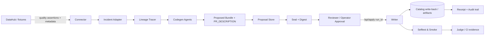

# Remedi Architecture

## Data flow details

- **Input split by mode:** fixture catalog (`examples/fixtures`) for judge reproducibility; live mode via DataHub + MCP/SDK.
- **Core control plane:** the orchestrator enforces propose-first behavior and writes only with sealed plans.
- **Safety boundary:** no local/fixture fallback in live paths and no blind re-generation on apply.
- **Output:** review-ready artifacts (dbt / SQL / Airflow / Dagster / Prefect), proposal receipts, and catalog write-back actions.
